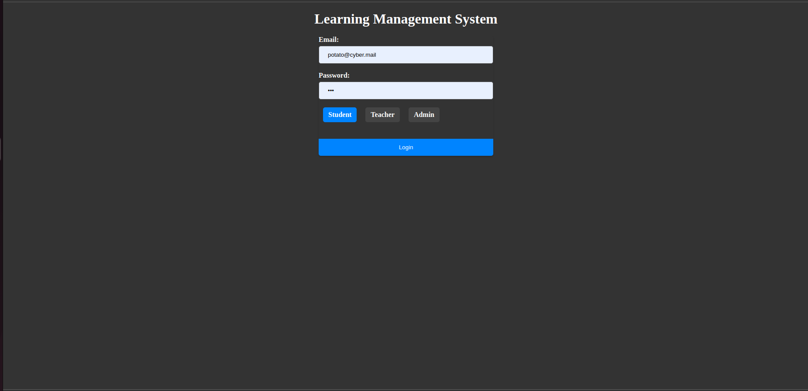
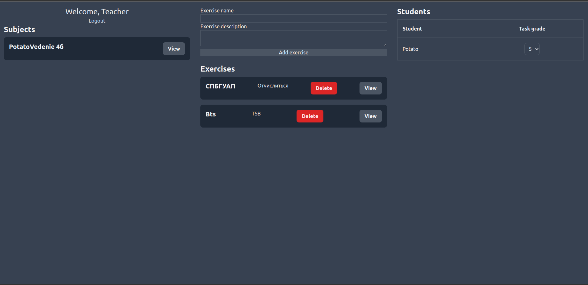
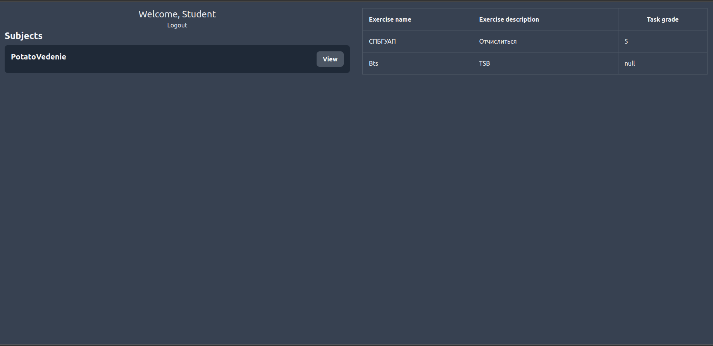
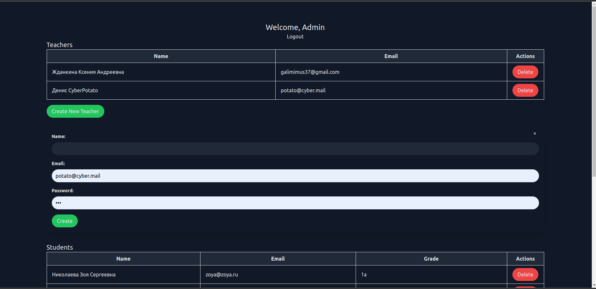
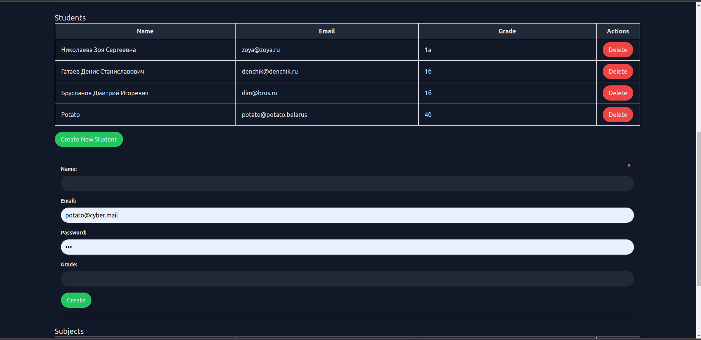
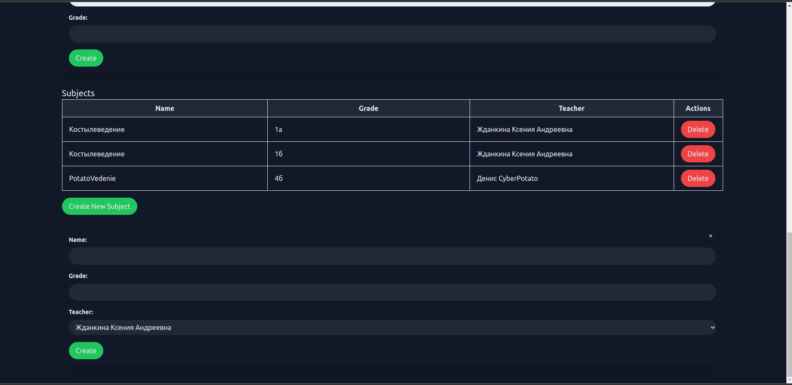

Отчёт по курсовой работе
========================
*по курсу Основы программирования*  

выполнила: Жданкина К.А. 3131 группа  
преподаватель: Жиданов К.А.

Санкт-Петербург, 2022 г. 

#### Техническое задание
------------------------
- Проектирование дизайна;
- Верстка сайта;
- Создание клиент-серверной части;
- Публикация проекта.

#### Выбор технологии
------------------------
*Платформа:* Replit  
*Среда разработки:* VSCode, Apache2  
*Инструменты:* PHP 8.1, MySQL-8.0.31, Apache/2.4.52, PhpMyAdmin, JS  
*Фреймворк:* Tailwind  

#### Процесс реализации
------------------------
#### Пользовательский интерфейс
1. login.html

2. teacher.html

3. student.html

4. admin.html




#### 2. Пользовательский сценарий работы
Пользователь попадает на страницу регистрации**login.html**. 
 Пользователь вводит email, пароль и роль, под которой он хочет войти(админ, учитель, ученик).
 В зависимости от выбранной роли и корректности данных происходит перенаправление на одну из трех страниц или сообщение ползователю о некорректности данных.
 
  В своем личном кабинете **admin.html** админ может создавать, видеть и удалять учителей, учеников, предметы.
  
  В своем личном кабинете **teacher.html** учитель может создавать новые задания, просматривать и удалять старые и выставлять ученикам оценки.
  
  В своем личном кабинете **student.html** ученик может просматривать предметы и задания с выставленными и не выставленными оценками.
#### 3. [API сервера и хореография](https://sequencediagram.org/index.html#initialData=IYYwLg9gTgBIWCCG4QQHCCFYQQvCCCEQAUAB2FMASxELwDswZBCEBUAEQQJhA6stFVMBaAPhoboC4YwAK5gAFgHoANhADmhMgDoconM1BEAbsDABTanUa1mrdBgA87dj0MCATAAZ7MAPIBpcQBZ7HmADlnACowAGLOAKq+ACLMWAAmOuqEWrr6vEYsyKZc1vyCsQC28uLAsbEAymBC8RRKKmrgSdp6OekmmBZWBrkOTm7iMF5OAEIAgpEwAEoAogCKYVNlATHxicnNXelxCQ1rqYbGmRzcGwIlhWTi8ZI6uhVVOjXKqlirTXtMGWzmli12ji7uAb-UbjaZzBZLZgrHZvFoxLavFJwz5ZY5pU4FIqSQgAZzAd2qYBxtWeiPWaQOXw6vxgPQBy22mlhGwZZPerUOGGyJzy52KpQC21EOigJPqTKRLJR7R+PLpfSBwzGk1m80WrJhkopUMZjS1+2lXLRNl5RSuNx0gtAwtFT3FevJBra3066Np-wVgxgIJV4PVOrZyIRmsdH2d3LdZyxuLAVpANuJdpeIfZlNM1LlHtcGoloc20NzqcNEZNUYuJXKQgARgArHTgMXJwvI50Zt3ywFen1gtWQ4PNqUFh1F8PG3Jly46a63at1htJwNS1uy9tZ-pd5U9iE54dBoe7FuckvjzEXbF4sqz+tExuL7XL10mjs7g9S-u7pdHse0AR4+4UcQZBuS9a2vRM6ibD9705NsnyzF9mW1AMU0PL5jx-GA-0JKQYwCYAcQAaxxABxKASh0cDSRQz8qRXODemzZCByQ-dEKdL8aV0a0RXEeNgDIIC8MIkiyPiSj7VfaDaMfbo10Vb1N1VbcmKgg0YlHTihR4kAoASXQpgADxFEgcR0W9qKk9M6Nkhj12BRS-T7Vj9Q+YtvwELj4x4819KMqATLMhcLPY6SaWfFTJLUtzNO4qBAJuQzjNxCjzOYkKrJkjDwvfSLXI0nlPJteL8SvcBxMg3KOVCzMGIQlzNmigqtLioDY3wojSPI8q73SmVMr+WqIrYvKOJ5YQxCkWQIBEVLVLDGDrKytcvB8fwglCCJIiAA)


#### 4. Структура базы данных

 Таблица *admins*
| Название | Тип | NULL | Описание |
| :------: | :------: | :------: | :------: |
| **id** | INT  | NO | Автоматический идентификатор |
| **name** | VARCHAR(1024) | NO | email админа |
| **password** | VARCHAR(512) | NO | пароль админа |

Таблица *exercises*
| Название | Тип | NULL | Описание |
| :------: |  :------: | :------: | :------: |
| **exercise_id** | INT | NO | Автоматический идентификатор задания |
| **text** | TINYTEXT | NO | Текст задания |
| **subject_id** | INT | NO | идентификатор предмета |
| **teacher_id** | INT | NO | идентификатор учителя |
| **name** | VARCHAR(1024) | NO | Тема задания |

Таблица *students*
| Название | Тип | NULL | Описание |
| :------: | :------: | :------: | :------: |
| **grade_name** | VARCHAR(4)  | NO | Класс учащегося |
| **student_id** | INT | NO | Автоматический идентификатор учащегося |
| **student_name** | VARCHAR(1024) | YES | Имя учащегося |
| **password** | VARCHAR(512) | NO | Пароль учащегося |
| **email** | VARCHAR(255) | NO | email учащегося |

Таблица *subjects*
| Название | Тип | NULL | Описание |
| :------: | :------: | :------: | :------: |
| **subject_id** | INT  | NO | Автоматический идентификатор предмета |
| **subject_name** | VARCHAR(64) | NO | Название предмета |
| **grade_name** | VARCHAR(4) | NO | Класс, у которого ведется предмет |
| **teacher_id** | INT  | NO | идентификатор учителя |


Таблица *tasks_grades*
| Название | Тип | NULL | Описание |
| :------: | :------: | :------: | :------: |
| **student_id** | INT  | NO | идентификатор учащегося |
| **exercise_id** | INT | NO | идентификатор задания |
| **task_grade** | INT | NO | Оценка |
| **id** | INT  | NO | Автоматический идентификатор строки |


Таблица *teachers*
| Название | Тип | NULL | Описание |
| :------: | :------: | :------: | :------: |
| **id** | INT  | NO | Автоматический идентификатор учителя |
| **teacher_name** | VARCHAR(1024) | NO | Имя учителя |
| **password** | VARCHAR(512) | NO | Пароль учителя |
| **email** | VARCHAR(255) | NO | email учителя |


#### 6. Значимые фрагменты кода

**Получение оценок за задание для учителя с помощью LEFT JOIN запроса(getTasksGrades.php)**
```php
if(!check_rights(Role::teacher)) die();

check_get_field('exercise_id', 'int');
check_get_field('grade_name', 'string');

$exercise_id = $_GET['exercise_id'];
$grade_name = $_GET['grade_name'];

$teacher_id = unserialize($_SESSION['user'])->id;

$link = new Database();
$link = $link->connect();

// check if exercise belongs to teacher
$query = "SELECT * FROM exercises WHERE exercise_id = '$exercise_id' AND teacher_id = '$teacher_id'";
$result = check_query(mysqli_query($link, $query), 'Database error', 500);
check_query(mysqli_num_rows($result), 'No such exercise for teacher', 400);

// check if grade belongs to teacher

$query = "SELECT * FROM subjects WHERE grade_name = '$grade_name' AND teacher_id = '$teacher_id'";
$result = check_query(mysqli_query($link, $query), 'Database error', 500);
check_query(mysqli_num_rows($result), 'No such grade for teacher', 400);


$query = "SELECT students.*, tasks_grades.task_grade FROM students
LEFT JOIN tasks_grades ON students.student_id = tasks_grades.student_id AND tasks_grades.exercise_id = '$exercise_id' WHERE students.grade_name = '$grade_name'";

$result = check_query(mysqli_query($link, $query), 'Database error', 500);

$tasks_grades = array();

while($row = mysqli_fetch_assoc($result)) {
    $task_grade = array(
        'student_id' => $row['student_id'],
        'student_name' => $row['student_name'],
        'task_grade' => $row['task_grade']
    );
    array_push($tasks_grades, $task_grade);
}

mysqli_close($link);

return_ok($tasks_grades, 200);
```

**Сериализация ответа сервера и отправка на клиент(result_helper.php)**
```php
function return_ok($data, $code)
{
    http_response_code($code);
    $result = array(
        "ok" => true,
        "result" => $data
    );
    header('Content-Type: application/json');
    echo json_encode_objs($result);
    die();
}

function return_error($detail, $code)
{
    http_response_code($code);
    $result = array(
        "ok" => false,
        "detail" => $detail,
        "code" => $code
    );
    header('Content-Type: application/json');
    echo json_encode_objs($result);
    die();
}

function json_encode_objs($item)
{
    if (is_object($item) || (is_array($item)&&isAssoc($item))) {
        $pieces = array();
        foreach ($item as $k => $v) {
            $pieces[] = "\"$k\":" . json_encode_objs($v);
        }
        return '{' . implode(',', $pieces) . '}';
    } else if(is_array($item)) {
        $pieces = array();
        foreach ($item as $k => $v) {
            $pieces[] = json_encode_objs($v);
        }
        return '[' . implode(',', $pieces) . ']';
    }else{
        return json_encode($item);
    }

}


function isAssoc(array $arr)
{
    if (array() === $arr) return false;
    return array_keys($arr) !== range(0, count($arr) - 1);
}
```

**Функции для создания карточек предметов(student.js)**
```js
function getSubjects() {

    fetch(BASE_API_URL + 'student/getSubjects.php')
        .then(response => response.json())
        .then(data => {
            if (!data.ok) {
                console.log(data);
                return;
            }
            createSubjectCard(data.result);
        })
        .catch(error => {
            console.log(error);
        });
}

function createSubjectCard(subjects) {
    const leftColumnBody = document.getElementById('subjects-cards');
    subjects.forEach(subject => {
        const newCard = document.createElement('div');
        newCard.setAttribute('id', 'subject-' + subject.id);
        newCard.setAttribute('class', "p-4 bg-gray-800 dark:bg-gray-700 rounded-lg mb-4 flex justify-between");
        newCard.innerHTML = `
        <h3 class="text-xl font-bold mb-2 text-gray-100 dark:text-gray-800">${subject.name}</h3>
        <button class="bg-gray-600 dark:bg-gray-500 rounded-lg px-4 py-2 text-gray-100 dark:text-gray-800 font-bold" onclick="getExercises(${subject.id})">View</button>
      `;
        leftColumnBody.insertAdjacentElement("afterbegin", newCard);
    });
}

```
**Функции для получения и изменения оценок ученика(teacher.js) **
```js
function getTaskGrades(exercise_id, grade_name) {
    const rightColumn = document.getElementById('right-column');
    rightColumn.style.display = 'block';

    fetch(BASE_API_URL + 'teacher/getTasksGrades.php?exercise_id=' + exercise_id + '&grade_name=' + grade_name)
        .then(response => response.json())
        .then(data => {
            if (!data.ok) {
                console.log(data);
                return;
            }
            createStudentRow(data.result, exercise_id);
        })
        .catch(error => {
            console.log(error);
        });
}

function changeTaskGrades(student_id, exercise_id, task_grade) {
    fetch(BASE_API_URL + 'teacher/changeTasksGrades.php?exercise_id=' + exercise_id + '&student_id='+student_id+'&task_grade='+task_grade)
        .then(response => response.json())
        .then(data => {
            if (!data.ok) {
                console.log(data);
                return;
            }
        })
        .catch(error => {
            console.log(error);
        });
}

function createStudentRow(students, exercise_id) {
    const tableBody = document.getElementById('student-table');
    tableBody.innerHTML = "";

    students.forEach(student => {
        const newRow = document.createElement('tr');
        newRow.setAttribute('id', 'student-' + student.student_id);
        newRow.innerHTML = `
        <td class="p-4 border border-gray-600 dark:border-gray-200 bg-gray-700 dark:bg-gray-800 text-gray-100 dark:text-gray-800">${student.student_name}</td>
        <td class="text-center p-4 border border-gray-600 dark:border-gray-200 bg-gray-700 dark:bg-gray-800 text-gray-100 dark:text-gray-800">
            <select id="select-${student.student_id}" class="text-center p-2 border border-gray-600 dark:border-gray-200 bg-gray-700 dark:bg-gray-800 text-gray-100 dark:text-gray-800 rounded-lg" onchange="changeTaskGrades(${student.student_id}, ${exercise_id}, this.value);">
                <option value="">${student.task_grade}</option>
                <option value="2">2</option>
                <option value="3">3</option>
                <option value="4">4</option>
                <option value="5">5</option>
            </select>
        </td>
      `;
        tableBody.appendChild(newRow);
    });
}
```
#### Тестирование
-------------------
После реализации проекта было выполнено smoke-тестирование (проверка ключевых функций проекта). Результаты показали ожидаемые ответы, как на ошибочные данные, так и на корректные.

#### Внедрение
------------------
Проект был опубликован в Интернете с помощью Replit. Файловая организация анологична, как и в локальном варианте. Структура базы данных была импортирована.  
**Доступ к проекту:** https://galimimus-1.galimimus.repl.co/
